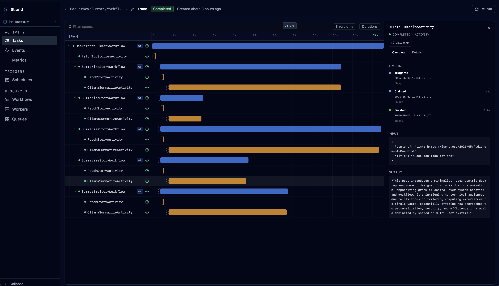

# Loom

Loom is the dashboard UI for [Strand](https://github.com/thoven87/strand), providing a web interface to visualise and monitor workflows, activities, queues, workers, schedules, and events in a running Strand system.

<div align="center">
  
</div>

## Development

Loom is a [Vite](https://vitejs.dev/) + [React 18](https://react.dev/) +
[TanStack Router](https://tanstack.com/router) app written in TypeScript.

### Prerequisites

- Node.js 20+
- A running Strand API server on `http://localhost:8080` (see the root
  `docker-compose.yml` and `Examples/Sources/DevServer`)

### Start the dev server

```bash
cd loom
npm install
npm run dev
```

The dashboard will be available at `http://localhost:5173`. API requests are
proxied to `http://localhost:8080`.

## Building for production

```bash
cd loom
npm run build
```

The production bundle is written to `../Sources/StrandServer/Resources/ui/`
and served by the embedded Hummingbird HTTP server.

## Configuration

In development the API base URL is determined by the Vite proxy. In production
the UI is served from the same origin as the API so no extra configuration is
needed.

| Environment variable | Default | Description |
|---|---|---|
| `VITE_API_URL` | *(same origin)* | Override the API base URL (dev only) |

## Structure

```
loom/
├── src/
│   ├── api/          # Axios wrappers for every API endpoint
│   ├── components/   # Shared UI components (Shell, TraceTree, dialogs …)
│   ├── lib/          # Utilities (query keys, namespace storage, helpers)
│   └── routes/       # One file per page
├── index.html
├── vite.config.ts
└── tailwind.config.ts
```

## Theming

Loom respects the operating system colour-scheme preference and renders in
light or dark mode automatically. The CSS custom properties for both themes
live in `src/index.css`.
